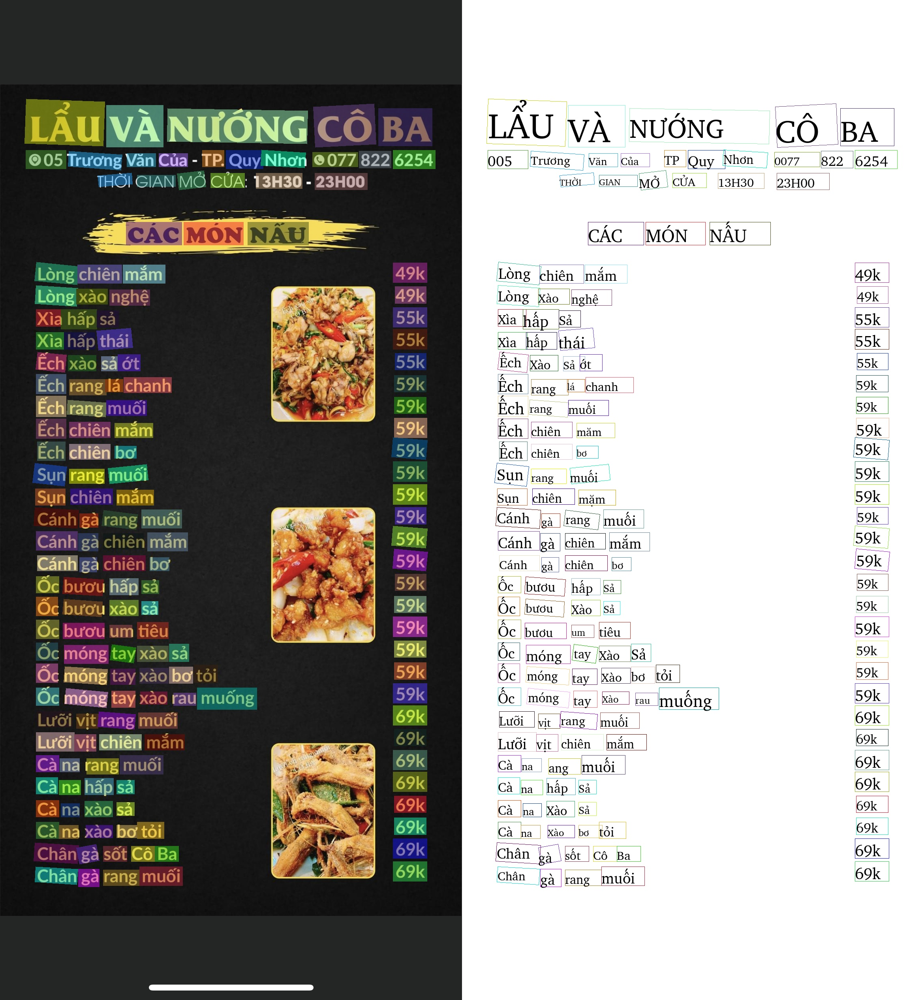
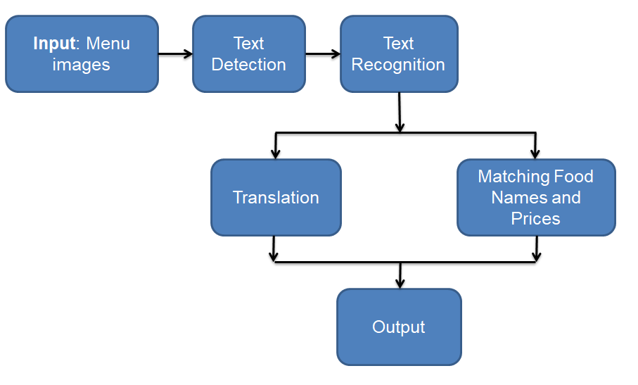

# Description
- Input: Menu images
- Output: 
    - Merge food name and price
    - Translate Vietnamese to English

---

# Survey
- Text Detection: [Pannet](https://github.com/WenmuZhou/PAN.pytorch), [Craft](https://github.com/clovaai/CRAFT-pytorch), [EAST](https://github.com/argman/EAST), [DBNet](https://github.com/phamdinhkhanh/general_ocr/blob/main/configs/textdet/dbnet/README.md), [Bezier](https://github.com/Yuliang-Liu/bezier_curve_text_spotting).

- Text Recognition: [VietOCR](https://github.com/pbcquoc/vietocr), [DeepText](https://github.com/clovaai/deep-text-recognition-benchmark), [Aster](https://github.com/bgshih/aster), [MORAN](https://github.com/Canjie-Luo/MORAN_v2).

- E2E: [PPOCR](https://github.com/PaddlePaddle/PaddleOCR), [mmOCR](https://github.com/open-mmlab/mmocr), [AdelaiDet](https://github.com/aim-uofa/AdelaiDet).

- Post_processing: [Annoy](https://github.com/spotify/annoy), [
RapidFuzz](https://github.com/maxbachmann/RapidFuzz?fbclid=IwAR0HffzFqj1WiUuXYITxFcxbZBokBKQmySXtiyaMYVk3E474GGIw2rZ569I), [FuzzyWuzzy](https://www.geeksforgeeks.org/fuzzywuzzy-python-library/), [Difflib](https://iq.opengenus.org/difflib-module-in-python/?fbclid=IwAR304LkvfwFGjzEQctCPJU4MW4bkHnzNw7MqULiuHYQpv8q7HFRrDy3_34k#:~:text=get_close_matches.%20Another%20simple%20yet%20powerful%20tool%20in%20difflib,function%20works%20like%20this%3A%20get_close_matches%28target_word%2C%20list_of_possibilities%2C%20n%3Dresult_limit%2C%20cutoff%29), [Threading](https://realpython.com/intro-to-python-threading/?fbclid=IwAR0WLMA-vz44Mzcv1ahdZpxlAtY2NjizfVntPTODkOV4n_x_s89MoJcr2oA), [Sort Point](https://dev-qa.com/2040644/the-best-way-to-sort-points-in-2d-by-table).

- Image Rotation: [Document-Scanner-and-OCR](https://github.com/ankitshaw/Document-Scanner-and-OCR), [Document Scanner](https://github.com/MrGrayCode/OpenCV-Projects/tree/master/Document%20Scanner), [Deskew](https://github.com/sbrunner/deskew), [skew_correction](https://github.com/prajwalmylar/skew_correction).

- Translation: [Hugging Face](https://github.com/huggingface/transformers?fbclid=IwAR03bGv-MoW9haC7LWIO5-i35q8hYCBVUWNbFl2NaTG8qI6ZT61Dpd5PPT4), [Machine Translation](https://github.com/3ba2ii/Machine-Translation-NLP).

---

# Problem Solving Strategies

---

# Performance

VinAI Dataset

| Detection | Recognition | Time with CPU |
| :-- | :-: | :-: |
| [**EAST-ResNet50_vd**](https://github.com/PaddlePaddle/PaddleOCR/blob/release/2.6/configs/det/det_r50_vd_east.yml) | [**SVTR-Tiny**](https://github.com/PaddlePaddle/PaddleOCR/blob/release/2.6/configs/rec/rec_svtrnet.yml) | 18.0 *(s)* |
| [**EAST-ResNet50_vd**](https://github.com/PaddlePaddle/PaddleOCR/blob/release/2.6/configs/det/det_r50_vd_east.yml) | [**PPOCRV3 (Quantization)**](https://github.com/PaddlePaddle/PaddleOCR/blob/release/2.6/configs/rec/PP-OCRv3/en_PP-OCRv3_rec.yml) | 16.0 *(s)* |
| [**EAST-MobileNetV3**](https://github.com/PaddlePaddle/PaddleOCR/blob/release/2.6/configs/det/det_mv3_east.yml) | [**SVTR-Tiny**](https://github.com/PaddlePaddle/PaddleOCR/blob/release/2.6/configs/rec/rec_svtrnet.yml) | 13.0 *(s)* |
| [**EAST-MobileNetV3**](https://github.com/PaddlePaddle/PaddleOCR/blob/release/2.6/configs/det/det_mv3_east.yml) | [**PPOCRV3 (Quantization)**](https://github.com/PaddlePaddle/PaddleOCR/blob/release/2.6/configs/rec/PP-OCRv3/en_PP-OCRv3_rec.yml) | 12.0 *(s)* |
| [**PPOCRV3 (Convert ONNX)**](https://github.com/PaddlePaddle/PaddleOCR/blob/release/2.6/configs/det/ch_PP-OCRv3/ch_PP-OCRv3_det_student.yml) | [**PPOCRV3 (Convert ONNX)**](https://github.com/PaddlePaddle/PaddleOCR/blob/release/2.6/configs/rec/PP-OCRv3/en_PP-OCRv3_rec.yml) | 3.0 *(s)* |

---

# Train model
1. Text Detection: [Text Detection](https://github.com/anminhhung/Smart_menu_OCR/blob/master/notebook/PPOCR_Detection.ipynb). 
2. Text Recognition: [Text Recognition](https://github.com/anminhhung/Smart_menu_OCR/blob/master/notebook/PPOCR_Recognition.ipynb). 

# Inference (Convert ONNX)
1. Colab
    - Link colab: [link](https://github.com/anminhhung/Smart_menu_OCR/blob/master/notebook/PPOCR_Inference.ipynb).  

---

# Build and run docker
1. Build docker
    - **Create dockerfile**: [link Dockerfile](https://github.com/anminhhung/Smart_menu_OCR/blob/master/Dockerfile).
    - **Build image:**

            docker build -t <name_image>:<version> .

2. Run Docker

    - **Run image:**
            
            docker run --name <container_name> -p 5000:5000 <image_name>

3. Save Docker

    - **Save image:**

            docker save -o <name>.tar <name_image>

